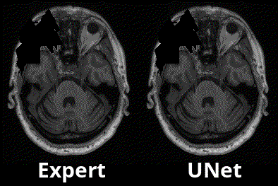
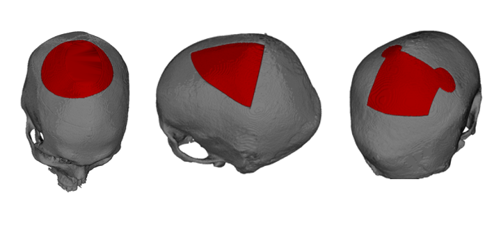

# 3D U-Net Convolution Neural Network

[[Update August 2022 - data loading is now 10x faster!](doc/Changes.md)]

## Tutorials
### [Brain Tumor Segmentation (BraTS 2022)](examples/brats2020)

### [Anatomical Tracings of Lesions After Stroke (ATLAS 2.0)](examples/atlas_2022)

### [Automatic Cranial Implant Design (AutoImpant 2020)](examples/autoimplant2020)

## Background
We designed 3DUnetCNN to make it easy to apply and control the training and application of various deep learning models to medical imaging data.
The links above give examples/tutorials for how to use this project with data from various MICCAI challenges.

## Installation
Clone the repository: 
`git clone https://github.com/ellisdg/3DUnetCNN.git`

Install the required dependencies*: 
`pip install -r 3DUnetCNN/requirements.txt`

*It is highly recommended that an Anaconda or virtual environment is used to 
manage dependcies and avoid conflicts with existing packages.

## [Pretrained Models](https://zenodo.org/record/4289225)

## Documentation
* ### [Configuration Guide](doc/Configuration.md)
* ### [Common Errors](doc/CommonErrors.md)
* ### [Frequently Asked Questions](doc/FAQ.md)

## Still have questions? 
Once you have reviewed the documentation, feel free to raise an issue on GitHub, or email me at david.ellis@unmc.edu.

## Citation
Ellis D.G., Aizenberg M.R. (2021) Trialing U-Net Training Modifications for Segmenting Gliomas Using Open Source Deep Learning Framework. In: Crimi A., Bakas S. (eds) Brainlesion: Glioma, Multiple Sclerosis, Stroke and Traumatic Brain Injuries. BrainLes 2020. Lecture Notes in Computer Science, vol 12659. Springer, Cham. https://doi.org/10.1007/978-3-030-72087-2_4

### Additional Citations
Ellis D.G., Aizenberg M.R. (2020) Deep Learning Using Augmentation via Registration: 1st Place Solution to the AutoImplant 2020 Challenge. In: Li J., Egger J. (eds) Towards the Automatization of Cranial Implant Design in Cranioplasty. AutoImplant 2020. Lecture Notes in Computer Science, vol 12439. Springer, Cham. https://doi.org/10.1007/978-3-030-64327-0_6

Ellis, D.G. and M.R. Aizenberg, Structural brain imaging predicts individual-level task activation maps using deep learning. bioRxiv, 2020: https://doi.org/10.1101/2020.10.05.306951
